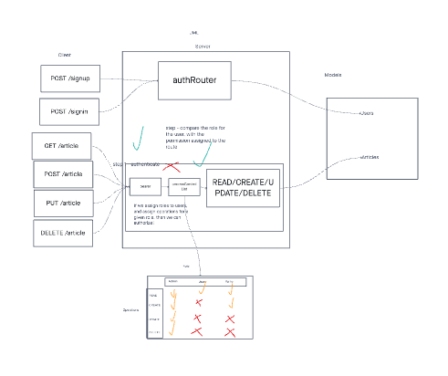

# Auth-API: Role Based Access Control

## Overview

This repository contains the code for the Auth-API, which is a role-based access control (RBAC) system that allows you to control access to routes at a granular level. In this phase of development, we are integrating an authentication server with an API server to create a single, authenticated API server.

## Business Requirements

In this phase, we want to make the following restrictions:

* Regular users can READ.
* Writers can READ and CREATE.
* Editors can READ, CREATE, and UPDATE.
* Administrators can READ, CREATE, UPDATE, and DELETE.

Routes that perform these actions in our API/Database need to be protected by both a valid user and that user’s permissions.

## Technical Requirements

### Task 1: Combine Auth and API Servers

Combine the provided auth-server and api-server into a single server. Your server should respond to the following routes:

* POST /signup to create a user.
* POST /signin to log in a user and receive a token.
* GET /secret should require a valid bearer token.
* GET /users should require a valid token and "delete" permissions.

### Task 2: Create Protected API Routes (V2)

Create a new set of "Protected" API routes (V2) within the server. These routes must be protected with the proper permissions based on user capability, using Bearer Authentication and an ACL (Access Control List).

### Task 3: Apply Best Practices and Quality Engineering

Ensure that your code follows best practices and quality engineering standards.

## Testing

We have provided a suite of tests for various routes to ensure the functionality of the Auth-API.

## Conclusion

This Auth-API project is a critical component of our authentication and authorization system. By implementing role-based access control (RBAC) and protecting routes with proper permissions, we ensure a secure and scalable system. The integration of the authentication server and API server creates a powerful platform for future development.

